# AgoraHub (Civix)

  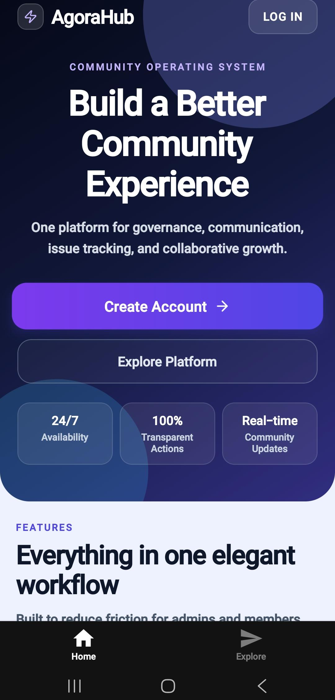

  <b>A Smart AI-Powered Community Governance Platform</b>

---

# Overview

AgoraHub is a unified digital platform developed to improve and simplify community governance in environments such as hostels, apartments, campuses, and clubs.

Traditional systems such as notice boards, paper-based complaints, and scattered messaging groups often create communication delays, poor transparency, and inefficient issue handling. AgoraHub solves these challenges using a centralized mobile-based solution integrated with AI-powered assistance, real-time communication, and structured governance workflows.

The platform ensures:

* Transparent administration
* Organized communication
* Real-time coordination
* AI-assisted decision support
* Secure member participation

---

# Front Page

  

The front page provides users with a clean and modern entry point into the platform. It introduces the core functionalities of AgoraHub and allows users to register, log in, or access community services efficiently. The interface is designed to improve accessibility and encourage active community participation.

---

# Community Creation Module

  

The Community Creation module allows Heads or Administrators to create community spaces such as hostels, apartments, clubs, and campuses. Each community is assigned a unique invite code which members can use to join.

This module manages:

* Community details
* Invite code generation
* Feature activation
* Access permissions
* Member approvals

It ensures organized management and proper communication within individual communities.

---

# Community Dashboard

  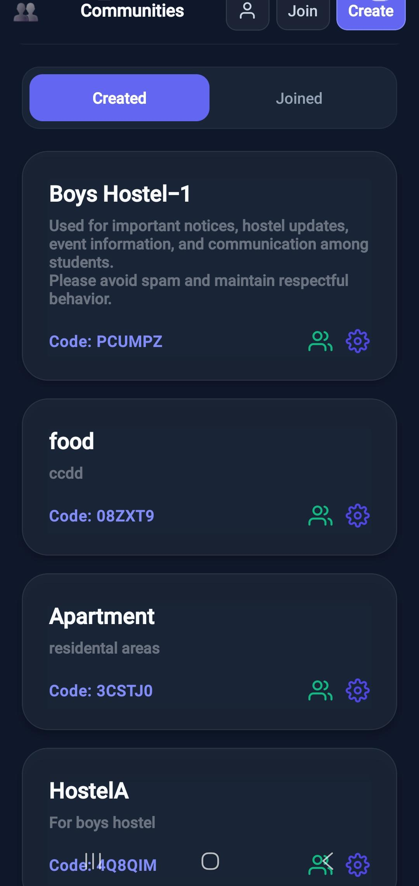

The community dashboard acts as the central workspace for all members. It displays announcements, complaints, petitions, chats, voting systems, and events related to the selected community.

The dashboard improves:

* Information accessibility
* Community coordination
* Transparency
* User engagement

---

# AI Chat Interface

  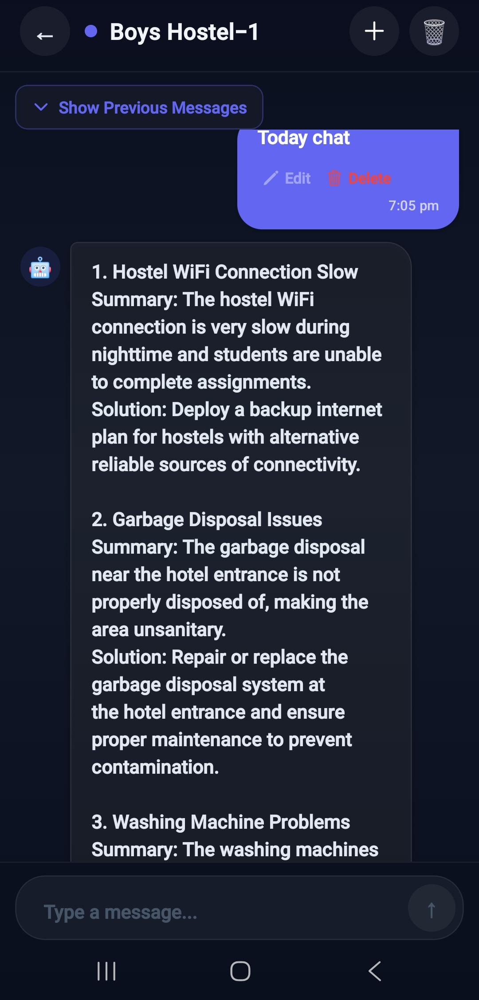

The AI Chat Interface provides community-aware intelligent assistance using Retrieval-Augmented Generation (RAG) and Large Language Models (LLMs).

The AI system retrieves relevant community documents and combines them with user queries before generating responses. This enables context-aware assistance instead of generic chatbot responses.

Functions include:

* Community question answering
* Rule clarification
* Event information
* Guidance support
* Multilingual interaction

---

# Complaint AI Module

  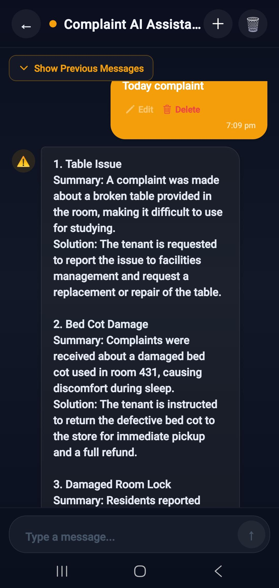

The Complaint AI module assists users in drafting, analyzing, and summarizing complaints. It uses NLP techniques such as sentiment analysis and toxicity detection to improve moderation and issue prioritization.

This module helps:

* Improve complaint quality
* Generate summaries
* Detect sensitive language
* Suggest resolutions
* Assist administrators

---

# Petition AI Module

  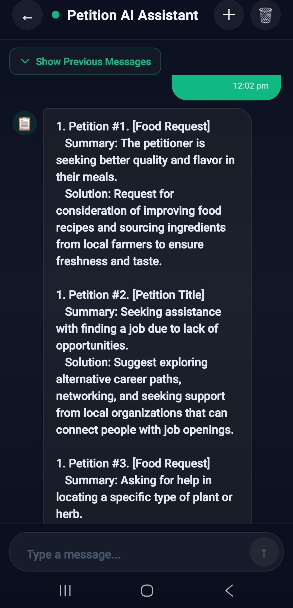

The Petition AI module provides intelligent support for community petitions. It analyzes petition content and helps users structure requests clearly and effectively.

The system can:

* Generate petition summaries
* Suggest improvements
* Analyze petition intent
* Support decision workflows

---

# Complaint Dashboard

  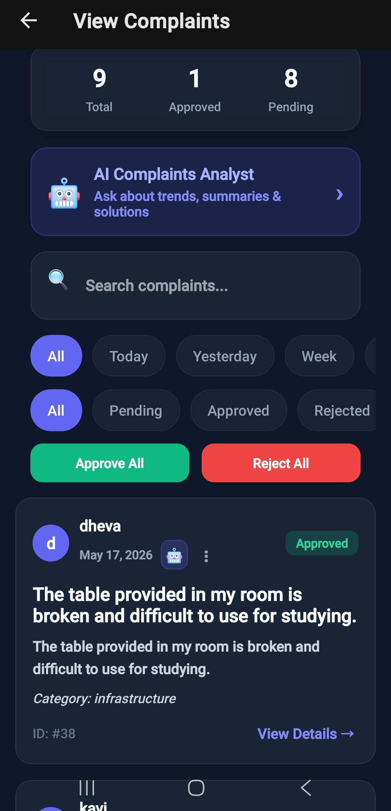

The Complaint Dashboard displays all submitted complaints along with their categories, severity levels, and current statuses.

Administrators can:

* Review complaints
* Update statuses
* Resolve issues
* Track progress
* Maintain accountability

The dashboard ensures transparency and efficient issue tracking within the community.

---

# Petition Dashboard

  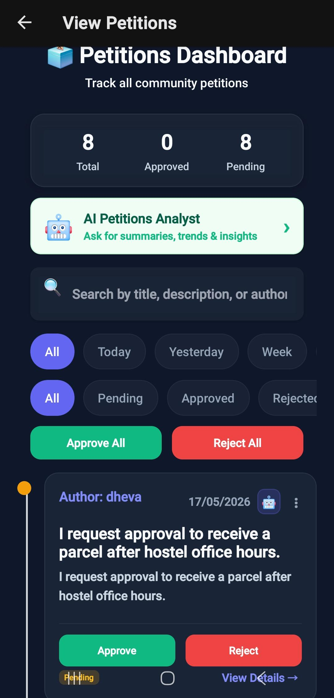

The Petition Dashboard organizes community petitions into structured workflows. Members can monitor petition progress while administrators review and manage requests systematically.

This improves:

* Transparency
* Participation
* Decision tracking
* Administrative efficiency

---

# Raise Complaint Module

  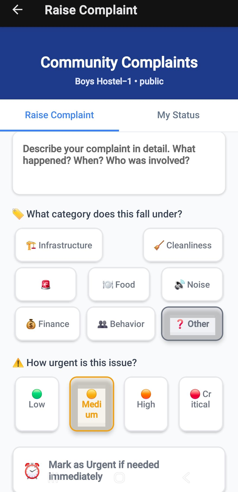

This interface allows members to submit complaints related to infrastructure, safety, maintenance, or community issues.

Each complaint contains:

* Title
* Description
* Severity
* Category
* Submission details
* Status tracking

The module ensures structured issue reporting instead of unorganized messaging.

---

# Petition Form Module

  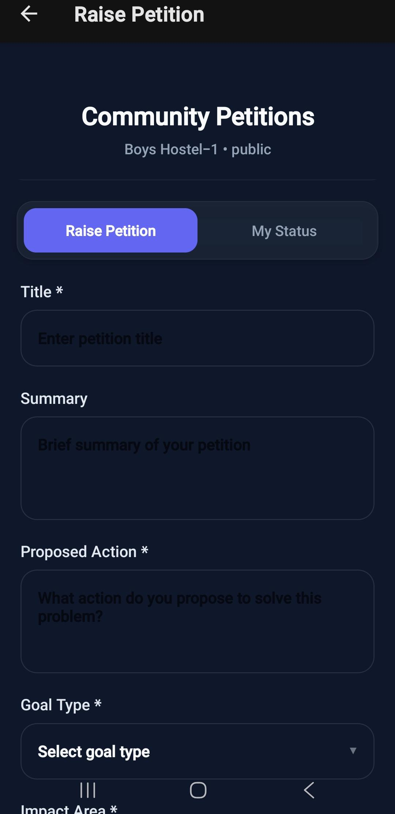

The petition form allows members to propose community changes, requests, or initiatives in a structured format.

This supports:

* Organized governance
* Collective participation
* Transparent approval processes
* Community engagement

---

# Voting System

  

The Voting Module enables communities to conduct real-time polls and democratic decision-making processes.

Administrators can:

* Create polls
* Configure privacy settings
* Set voting durations
* Control result visibility

Members can participate seamlessly through synchronized voting interfaces.

---

# Voting Results

  

The Voting Results interface displays live poll statistics and dynamic result visualizations.

It improves:

* Transparency
* Participation tracking
* Collective decision making
* Community trust

---

# Events Module

  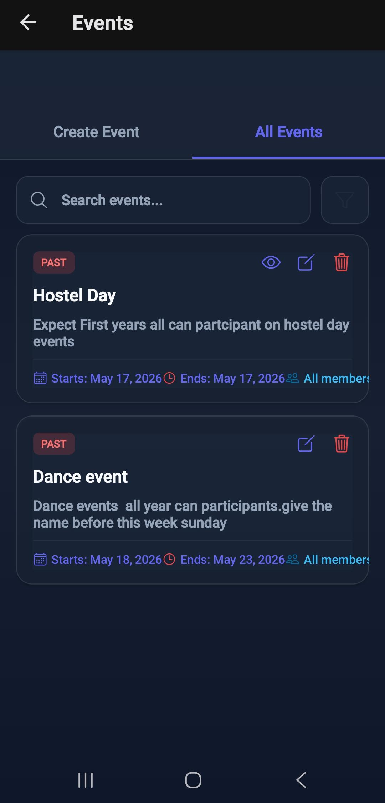

The Events Module allows administrators to organize meetings, celebrations, maintenance activities, and community programs.

The module manages:

* Event scheduling
* Date and time
* Announcements
* Participation coordination

---

# Announcement Module

  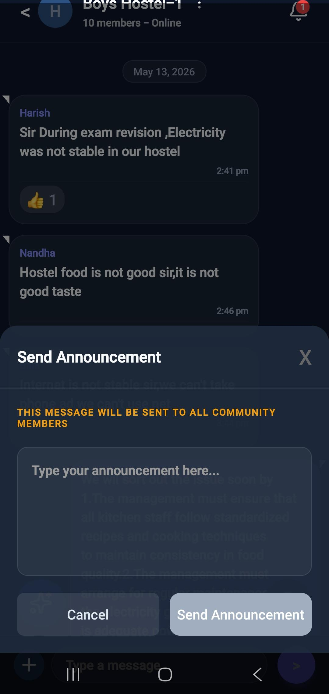

The Announcement Module enables Heads and Admins to broadcast important information to all members instantly.

This reduces communication delays and ensures that members remain informed about community activities and updates.

---

# Group Chat Module

  

The Group Chat system provides real-time communication between members using Socket.IO.

Features include:

* Instant messaging
* Message history
* Real-time synchronization
* Group coordination
* Community discussions

This eliminates dependency on external messaging platforms.

---

# Member Management Module

  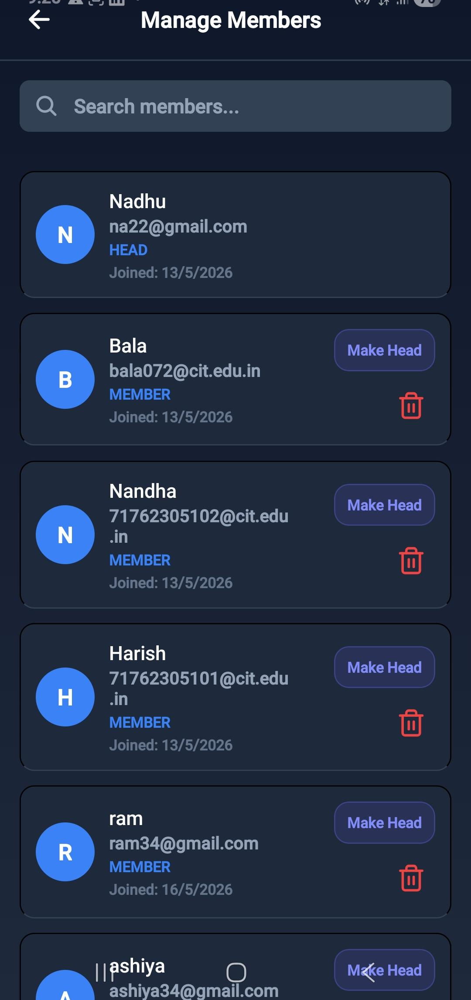

The Member Management module allows administrators to monitor and control community participation.

Functions include:

* Member approval
* Role assignment
* Community moderation
* Access control

This ensures secure and organized governance.

---

# System Architecture

  

The architecture follows a modular multi-layer design consisting of frontend, backend, database, AI services, and caching layers.

### Architecture Components

| Layer                   | Technology            |
| ----------------------- | --------------------- |
| Frontend                | React Native, Expo    |
| Backend                 | Node.js, Express.js   |
| Authentication          | JWT                   |
| Database                | PostgreSQL + pgvector |
| Real-Time Communication | Socket.IO             |
| AI Services             | Ollama / OpenAI       |
| Cache                   | Redis                 |
| Containerization        | Docker Compose        |

The architecture ensures:

* Scalability
* Security
* Real-time performance
* AI integration
* Modular development

---

# Use Case Diagram

  

The Use Case Diagram represents interactions between users and the AgoraHub system.

### Main Actors

* Member
* Admin
* Head
* AI System

### Core Functionalities

* Login and Registration
* Community Creation
* Complaint Management
* Petition Handling
* Chat and Announcements
* Voting and Polling
* Event Management
* AI Assistance

The diagram illustrates how users interact with different modules while maintaining role-based access control.

---

# AI & RAG Integration

AgoraHub integrates Large Language Models (LLMs) with Retrieval-Augmented Generation (RAG) to provide intelligent and context-aware assistance.

Instead of generating generic responses, the AI retrieves community-specific documents and contextual information before producing outputs.

This improves:

* Accuracy
* Relevance
* Transparency
* Context awareness

Supported AI functionalities:

* Complaint summarization
* Petition analysis
* Community Q&A
* Moderation assistance
* Multilingual support

---

# Security Features

* JWT Authentication
* bcrypt password hashing
* Role-based access control
* Secure API communication
* Community-level authorization
* AI moderation support

---

# Advantages

* Centralized governance
* Real-time communication
* Transparent complaint tracking
* AI-assisted administration
* Secure and scalable architecture
* Organized participation
* Improved coordination

---

# Future Enhancements

* Advanced analytics dashboard
* Mobile push notifications
* Video/audio meetings
* Smart recommendations
* Cloud deployment scaling
* Multilingual interface

---

# Tech Stack

## Frontend

* React Native
* Expo
* TypeScript

## Backend

* Node.js
* Express.js
* Socket.IO

## Database

* PostgreSQL
* pgvector

## AI & NLP

* Ollama
* OpenAI
* Redis
* RAG

## Security

* JWT
* bcrypt

## Deployment

* Docker Compose

---

# Conclusion

AgoraHub provides a modern, transparent, and intelligent approach to community governance by integrating communication, administration, participation, and AI assistance into one unified digital platform.

Using real-time technologies, secure authentication, vector databases, Retrieval-Augmented Generation (RAG), and modular architecture, AgoraHub transforms traditional community management into an efficient, scalable, and organized digital ecosystem.

---

