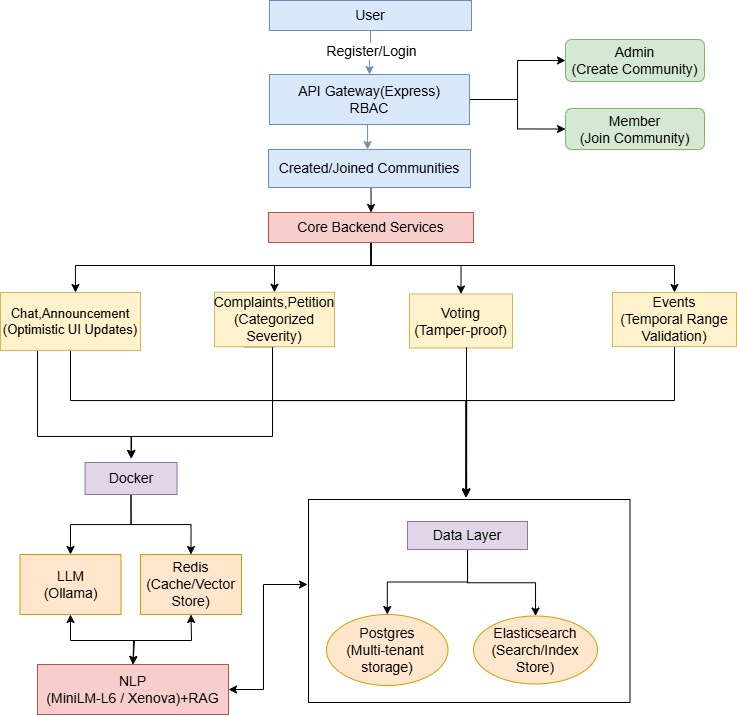
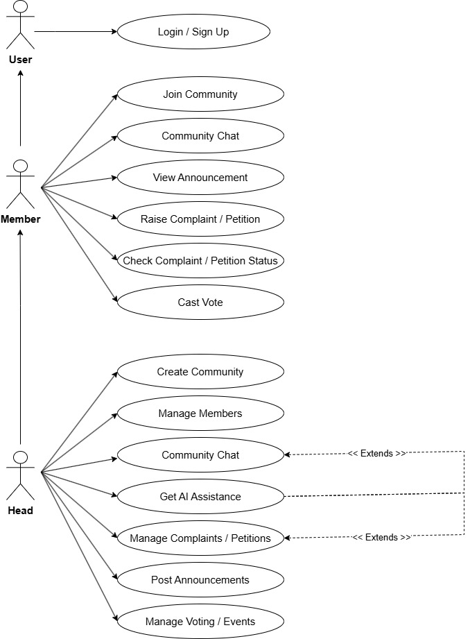

# AgoraHub (Civix)

AgoraHub is a unified digital platform developed to improve and simplify community governance in environments such as hostels, apartments, campuses, and clubs. Traditional communication methods such as notice boards, paper-based complaints, and scattered messaging groups often create communication delays, lack of transparency, and inefficient issue management.

AgoraHub replaces these traditional systems with a centralized and intelligent digital ecosystem that combines real-time communication, complaint handling, petitions, voting, event management, announcements, and AI-powered assistance into a single platform.

The platform integrates Large Language Models (LLMs) with Retrieval-Augmented Generation (RAG) to provide intelligent and context-aware assistance using community-specific information. The system is designed with modular architecture, security, scalability, and organized governance in mind.

---

# System Architecture

  

AgoraHub follows a modular multi-layer architecture consisting of frontend applications, backend services, AI systems, databases, and caching layers.

| Layer                   | Technology            |
| ----------------------- | --------------------- |
| Frontend                | React Native, Expo    |
| Backend                 | Node.js, Express.js   |
| Authentication          | JWT                   |
| Database                | PostgreSQL + pgvector |
| Real-Time Communication | Socket.IO             |
| AI Services             | Ollama / OpenAI       |
| Cache                   | Redis                 |
| Containerization        | Docker Compose        |

The architecture ensures:

* Scalability
* Real-time communication
* AI integration
* Security
* Efficient data processing

---

# Use Case Diagram

  

The Use Case Diagram represents interactions between users and the AgoraHub system.

### Main Actors

* Member
* Admin
* Head
* AI System

### Main Functionalities

* Registration and Login
* Community Creation
* Complaint Management
* Petition Handling
* Voting and Polling
* Event Management
* Real-Time Communication
* AI Assistance

The diagram illustrates how users interact with different modules while maintaining proper role-based access control.

---

# Overview

AgoraHub improves communication between administrators and community members by providing a structured environment for participation, issue tracking, and coordination. The platform centralizes all important community operations and reduces dependency on external messaging applications.

The platform supports:

* Community creation and management
* Real-time communication
* Complaint and petition workflows
* Voting and polling systems
* Event management
* AI-powered moderation and assistance
* Secure role-based access control
* Community-aware intelligent responses

---

# Features

## Community Management

* Create and manage communities
* Join using invite codes
* Role-based access control
* Community feature management
* Member approval workflows

## Communication System

* Real-time group chat
* Community announcements
* Notification support
* Message history storage

## Complaint & Petition System

* Structured issue reporting
* Complaint categorization
* Petition workflows
* AI-generated summaries
* Status tracking

## Voting & Polling

* Real-time voting system
* Poll privacy settings
* Dynamic result visualization
* Community participation tracking

## Events Management

* Event scheduling
* Community coordination
* Announcement broadcasting

## AI Assistance

* Community-aware chatbot
* Complaint AI assistant
* Petition AI assistant
* Sentiment analysis
* Toxicity detection
* Multilingual support

---

# Modules

## User Authentication & Registration Module

This module manages secure registration and login functionality using JWT-based authentication. It validates user credentials and assigns roles such as Head, Admin, and Member.

Functions:

* User registration
* Secure login
* Session management
* Authorization handling

---

## Community Management Module

This module allows users to create and join community spaces such as hostels, apartments, clubs, and campuses.

Functions:

* Community creation
* Invite code generation
* Feature toggles
* Member approvals
* Access management

---

## Chat & Announcement Module

This module enables real-time communication between members using Socket.IO.

Functions:

* Instant messaging
* Community announcements
* Real-time synchronization
* Notification support

---

## Complaint & Petition Module

This module provides structured workflows for issue reporting and community requests.

### Complaint Features

* Complaint submission
* Complaint categorization
* Severity management
* Status tracking
* AI-generated summaries

### Petition Features

* Petition creation
* Petition review workflows
* Approval/rejection management
* AI-generated recommendations

---

## Events Module

This module helps administrators organize meetings, celebrations, maintenance activities, and community programs.

Functions:

* Event scheduling
* Event announcements
* Participation coordination
* Date and time management

---

## AI Module

The AI module is an independent NLP service integrated with Ollama/OpenAI models and Retrieval-Augmented Generation (RAG).

Features:

* Sentiment analysis
* Toxicity detection
* Context-aware responses
* Multilingual processing
* Complaint and petition assistance

### AI Workflow

1. User submits a query
2. Relevant community documents are retrieved
3. Context is attached to the prompt
4. LLM generates intelligent responses
5. Responses are cached using Redis
6. Results are stored in PostgreSQL

---

## Voting Module

The Voting Module allows communities to conduct interactive real-time polls and democratic decision-making processes.

Functions:

* Poll creation
* Vote synchronization
* Result visualization
* Privacy configuration

---

# AI & RAG Integration

AgoraHub integrates Large Language Models (LLMs) with Retrieval-Augmented Generation (RAG) to provide intelligent and community-aware assistance.

Instead of generating generic AI responses, the system retrieves community-specific documents and contextual information before generating outputs.

This improves:

* Response accuracy
* Context awareness
* Transparency
* Relevance

Supported AI functionalities:

* Complaint summarization
* Petition analysis
* Community Q&A
* Moderation assistance
* Multilingual summaries

---

# Security Features

* JWT Authentication
* bcrypt password hashing
* Role-based access control
* Secure API communication
* Community-level authorization
* AI moderation support

---

# Advantages

* Centralized governance
* Organized communication
* Real-time interaction
* Transparent issue tracking
* AI-assisted administration
* Scalable architecture
* Improved community participation

---

# Future Enhancements

* Advanced analytics dashboard
* Push notifications
* Video/audio communication
* Smart recommendations
* Cloud deployment scaling
* Multilingual interface

---

# Tech Stack

## Frontend

* React Native
* Expo
* TypeScript

## Backend

* Node.js
* Express.js
* Socket.IO

## Database

* PostgreSQL
* pgvector

## AI & NLP

* Ollama
* OpenAI
* Redis
* RAG

## Security

* JWT
* bcrypt

## Deployment

* Docker Compose

---

# Screenshots

## Front Page

  

---

## Community Creation

  

---

## Community Dashboard

  

---

## AI Chat Interface

  

---

## Complaint AI

  

---

## Petition AI

  

---

## Complaint Dashboard

  

---

## Petition Dashboard

  

---

## Raise Complaint

  

---

## Petition Form

  

---

## Voting System

  

---

## Voting Results

  

---

## Events Module

  

---

## Announcement Module

  

---

## Group Chat Module

  

---

## Member Management

  

---

# Conclusion

AgoraHub provides a modern, transparent, and intelligent approach to community governance by integrating communication, administration, participation, and AI assistance into one unified digital platform.

By combining real-time technologies, secure authentication, vector databases, Retrieval-Augmented Generation (RAG), and modular architecture, AgoraHub transforms traditional community management into an efficient, scalable, and organized digital ecosystem.
